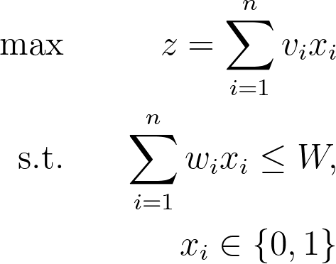

## Knapsack Problem
You are going on vacation and you want to pack your suitcase. What do you take with you? You cannot take all the items you want because your suitcase has a limited volume but there are certain items you need such as clothes or bathroom accessories. This is the basic so called Knapsack Problem. The objective is to maximize the usage of what you take to your vacation but under the constraint that you cannot fit everything in your suitcase.

Here ```w_i``` can be interpreted as the weight of an item ```i``` of value ```v_i```. The variable ```x_i``` is either 1 if you take the item ```i``` or 0 if you don't. The weightlimit is denoted as ```W```.



## Business Context
In the program I used an example which can be applied to business. There are many investment projects where you know how much money will be invested and how big the return is if you decide to invest. You are restricted by the budget. Obviously you want to maximize the returns using the available budget. The output of the program is
```
Project Return  Investment
5       5.8     9
7       4.8     10
9       7.3     8
10      7.8     14
-------------
Budget:         45
Investment:     41.0
Return:         25.7
```
